# OrcaStrator

OrcaStrator is a post-processing pipeline for OrcaSlicer (adaptable to other slicers), built primarily for
multi-toolhead (StealthChanger-style) printers, but could easily be adapted to other uses. It runs on your PC at
the moment you export a file, calling each processor in order. These processors can check and/or modify the g-code
and — optionally — report what they found/changed in a themeable console or on the printer itself when the print starts.

It's made up of four pieces:

- **OrcaStrator itself** — the pipeline runner. This is the one thing
  you register with OrcaSlicer.
- **Post-processors** — a set of independent checks/fixes that
  OrcaStrator runs, one after another, on every export. You can enable
  or disable them individually.
- **A Settings GUI** — a standalone app for configuring everything
  above without hand-editing files.
- **An optional Klipper macro** - lets the printer itself display what
  OrcaStrator found (like a dock collision warning) when the print
  starts, and can refuse to start a print that failed a check.

<p align="center">
	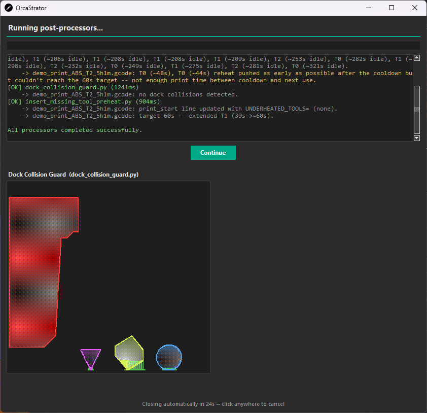
	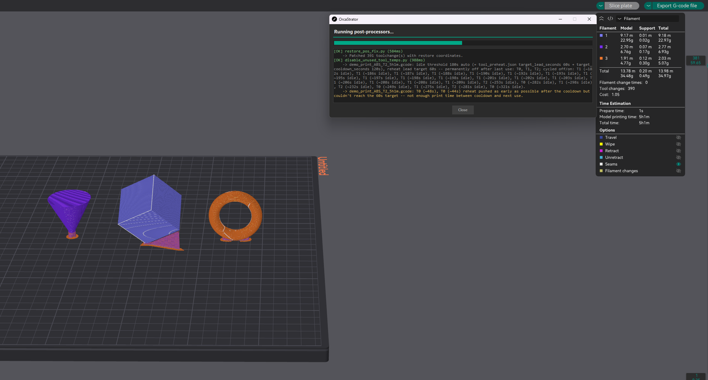
	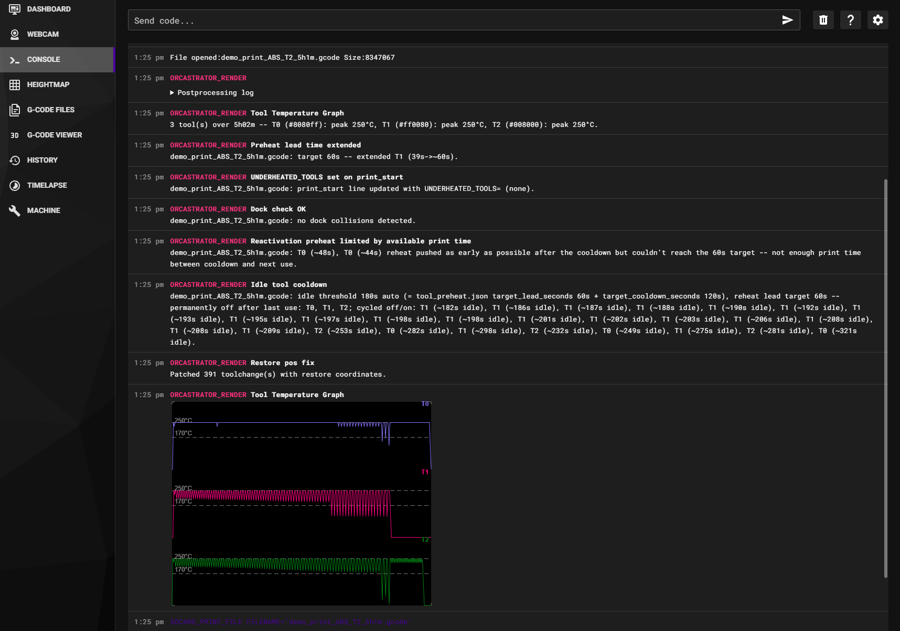
</p>

### Why use OrcaStrator
Slicer software as improved over the years but they still don't fully support multitoolhead printers as well as they should.
Modifying the gcode to better suit our printers trys to fill this gap.
But rather then run post procesors individually in the background or through a jarring command prompt window, with OrcaStrator everything happens in a customisable progress window that looks like its part of your slicer.
Every status is visible and we can display images to help identify changes or issues before a print begins.
With the klipper companion macro setup, any gcode that wasn't run through Orcastrator will be refused from printing, so you have piece of mind knowing the gcode is configured for your printer setup.

---

## How it works (the operation cycle)

1. You click **Print** (or **Export G-code**) in OrcaSlicer.
2. OrcaSlicer hands the exported file to OrcaStrator.
3. OrcaStrator runs every enabled post-processor against the file, in
   order. A small progress window shows what's happening.
4. Each post-processor can:
   - fix or annotate something in the g-code,
   - show you a visual (like an SVG diagram) right there on your PC,
   - or raise a warning/error if it found a real problem.
5. If any post-processor found a serious problem, OrcaStrator **fails
   the export** — OrcaSlicer will show its own error dialog, and you
   won't end up with a file to print until it's fixed. The progress
   window stays open until you close it, so you have time to read what
   went wrong.
6. Everything each post-processor reported is embedded into the g-code
   file itself, in a small header block.
7. *(Optional)* If you've installed the companion Klipper macro, the
   printer reads that header block when you start the print and
   displays the same information on the printer's own screen/console —
   and can refuse to start printing a file that failed a check, as a
   second layer of protection.

Nothing about step 7 is required for step 1–6 to work. Without the
macro installed, OrcaStrator still checks and fixes every file the
same way — you just won't see anything about it on the printer itself.

---

## Installation

### Requirements

- Python 3, with `tkinter` available (this is included with most
  Python installs; on some Linux distributions you may need to install
  a `python3-tk` package separately).
- No other software needs to be installed — everything OrcaStrator
  and its post-processors need is built into Python itself.

### 1. Unpack the folder

Extract the OrcaStrator folder anywhere convenient on your PC (it
doesn't need to be next to OrcaSlicer). Keep the folder structure
intact — everything inside it is expected to stay together. Except for the Klipper folder which needs to be uploaded to your printer and included in printer.cfg You may choose to delete it from your pc or keep it as a backup

### 2. Point OrcaSlicer at OrcaStrator

In OrcaSlicer, go to your printer's Process Global settings and
find the **Post-processing Scripts** field. Add a line pointing at
`orcastrator.py` inside the folder you extracted, for example:

```
"C:\Path\To\Python\pythonw.exe" "C:\Path\To\OrcaStrator\orcastrator.py";
```
to find the install path for python on windows open a command prompt and type ``where python``

(On Mac/Linux, use your `python3` path instead, and forward slashes.)

From now on, every export from this printer profile runs through OrcaStrator 

<p align="center">
	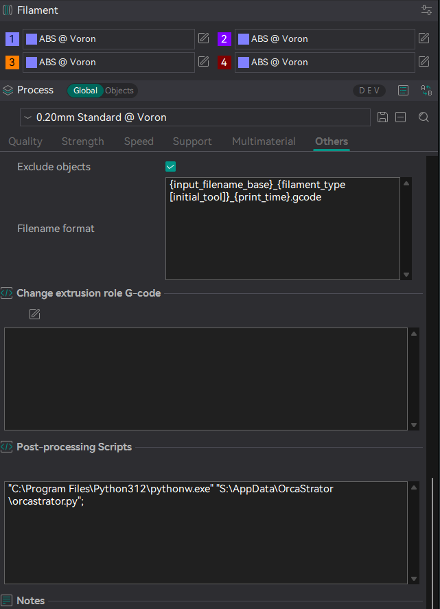
</p>

> OrcaSlicer's Post-processing Scripts field with an example path filled in

### 3. (Optional) Install the Klipper macro

If you want the printer itself to show OrcaStrator's results and be
able to refuse an unsafe file, upload the Orcastrator folder within the klipper folder and add the include line below to your
`printer.cfg`, pointing at the OrcaStrator folder included in the package:

```
[include OrcaStrator/*.cfg]
```

This macro replaces your printer's normal "print file from SD/virtual
SD" behavior with a version that first reads and displays whatever
OrcaStrator embedded in the file, then continues as normal. Skip this
step entirely if you don't want that — everything else still works.


> **Note:** the OrcaStrator_render macro replaces `SDCARD_PRINT_FILE`. If you already
> have another macro doing the same rename trick (a filament change
> system, a print-start logger, etc.), you'll want to make sure they
> chain together instead of one silently overriding the other.

> **Note:** this macro's on-printer visual display (the diagrams,
> not the text messages) depends on a separate `_SVG_TOOLS` macro.
>
> The original version is from Contomo's auto purge macro available here. 
> https://github.com/Contomo/klipper-toolchanger-hard/tree/main/examples/misc-macros#auto_purge
> The version used within this project has 'extra skills' such as text and dashed lines
> It has been included in the OrcaStrator folder and will be imported with the above include line

---

## Configuring OrcaStrator

Almost everything is configured through the **Settings GUI**
(`config_editor.pyw`), not by hand-editing files. Run it directly:

On windows you should be able to double click on config_editor.pyw or use open with and find python3/pythonw

This opens a landing page listing every setting group. Click one to
open its editor.

| On the landing page | Configures |
|---|---|
| **OrcaStrator** | The pipeline runner itself — the progress window's size/position, what happens when a check fails, and its color theme. |
| **Disable Unused Tool Temps** | The idle-cooldown threshold. |
| **Dock Collision Guard** | The dock collision check — boundary, visualization, and safety margins. This one has a live preview built in. |
| **G-code Template Notice** | A mini templating language for creating your own notices using data from the gcode. |
| **Insert Missing Tool Preheat** | Debug logging only — its one real setting lives under Tool Preheat. |
| **Restore Position Fix** | Debug logging only — this post-processor has no settings of its own. |
| **Tool Preheat** | Shared timing values used by two of the tool-heating post-processors (see below). |
| **Tool Temperature Graph** | Per-tool temperature-vs-time curve rendering — colors, line/area style, layout, canvas size. Has a live preview built from the last real export. |
| **Toolchange Heatmap** | Toolchange-clustering timeline rendering — colors, clustering sensitivity, canvas size. Has a live preview built from the last real export. |
| **Debug Logs** | A read-only viewer for the diagnostic files each post-processor can optionally write after every run (see *Debug logs* below). |

The landing page's order can be rearranged to suit you —
your custom order is remembered for next time. A newly added
post-processor with its own settings screen just shows up in its
default spot; nothing needs to be wired up by hand.

Every editor has:

- **Save** — writes your changes.
- **Save Backup / Load Backup** — saves a copy of the
  current settings, or restores one you saved earlier. Useful before
  making a big change, so you can always get back to a known-good
  configuration.

<p align="center">
	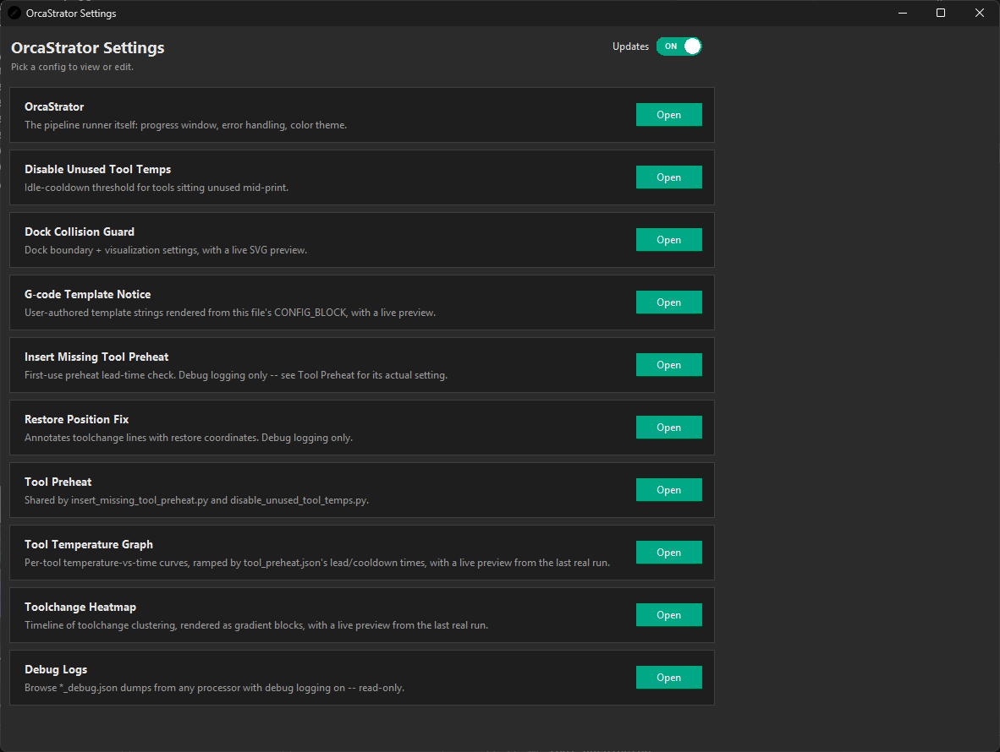
	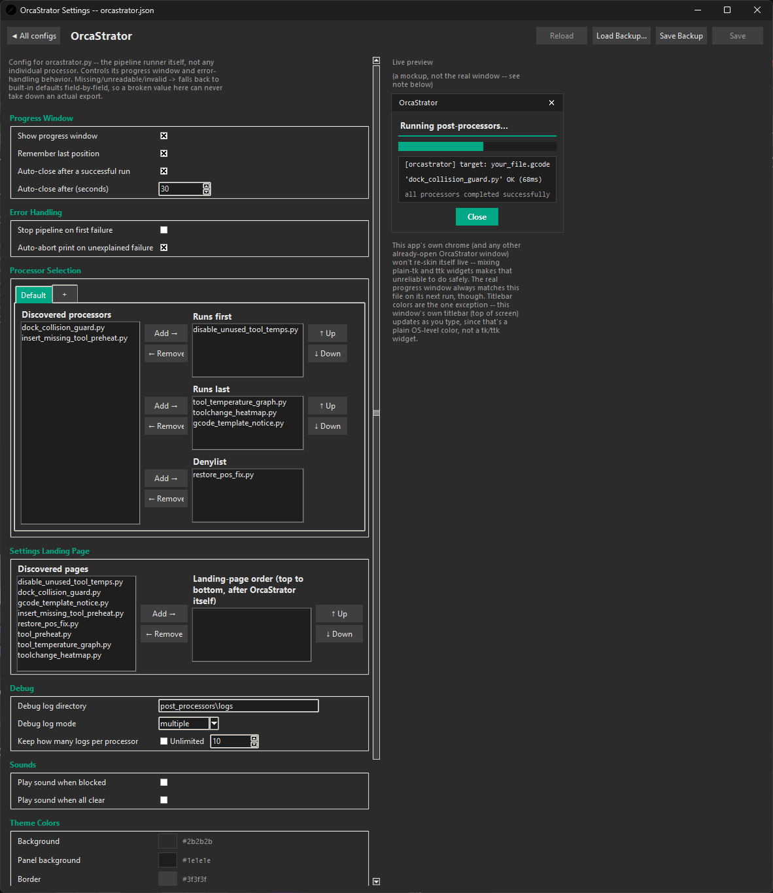
</p>

If you ever want to check or change a setting by hand instead, every
setting lives in a plain `.json` file inside the `configs/` folder,
and every value in those files has a plain-English comment directly
above it explaining what it does.

---

## The post-processors

Each of these runs automatically, in order, on every export. You can
turn any of them off from the **OrcaStrator** settings screen
(Processor Selection) without needing to remove any files.

There is also a "--denylist=script.py,..." param you can add if you want to disable any processor(s) for a particular print profile

<p align="center">
	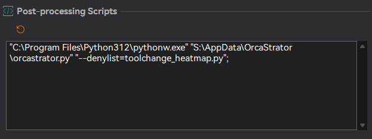
</p>


### Dock Collision Guard

Checks whether the toolhead will physically hit the tool dock at any
point during the print, given your printer's real dock clearance
envelope, and refuses to let an unsafe file be printed. This is a
**safety check** — if it finds a real collision, the export fails and
the print is blocked.

It also shows you a diagram of the print, the danger zone, and exactly
where the closest approach happened — on your PC when you export, and
on the printer's screen at print start if you've installed the
Klipper macro.

**How it decides pass/fail:** you define a boundary — a curve made of
Y/Z points — that describes the tallest a toolhead is allowed to be at
each Y position without hitting the dock (further from the dock = more
headroom allowed). OrcaStrator then walks through every point the
toolhead visits during the print and compares each one's actual height
against what your boundary allows at that Y position. If the toolhead
is ever taller than the boundary allows, that's a collision. It also
separately checks the momentary lift the printer performs *during* an
actual tool swap, using an assumed swap height you provide, since that
motion doesn't otherwise appear anywhere in the file. Anything within
a small configurable margin of the limit, but not over it, is flagged
as a "near miss" instead of a hard failure — worth a look, but not
blocking.

Settings available (all editable from the **Dock Collision Guard** screen):

- **Boundary** — the Y/Z clearance curve described above. See *Setting
  up the boundary* below.
- **Safe Y** — the Y position beyond which there's no dock risk at
  all, regardless of height.
- **Toolchange hop heights** — the assumed lift height, in mm, for the
  outbound (into the dock) and inbound (return-to-print) parts of a
  tool swap. These should match whatever your own toolchange macro actually
  does.
- **Near-miss margin** — how close (in mm) counts as "worth flagging"
  even though it didn't actually fail.
- **Visualization** — where the diagram shows up for each outcome (no
  issue / near miss / collision): nowhere, on the printer, on your PC,
  or both. Also covers how much context the diagram shows, colors, and
  a few display-only extras (travel move overlay, a standalone
  browser popup for running this check outside OrcaStrator entirely).

<p align="center">
	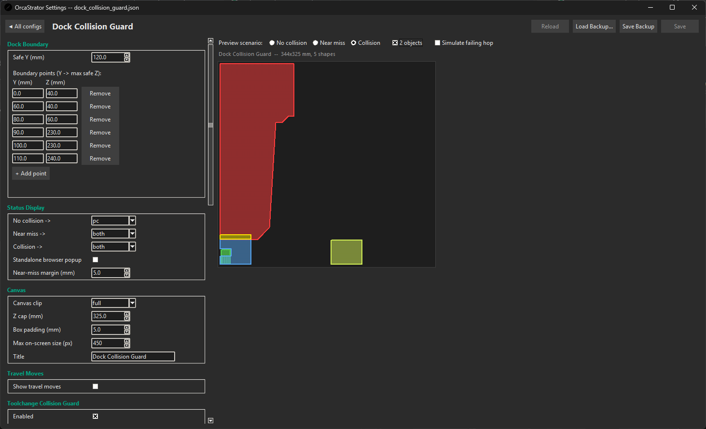
</p>

#### Setting up the boundary

The boundary describes a straight line between each point you
give it, the tallest the toolhead is allowed to be at a given
distance from the dock. You're essentially tracing the edge of the physical shape
of whatever your toolhead (or umbilical/ptfe tube) would hit.

1. In the Settings GUI, open **Dock Collision Guard**.
2. Home the printer, pickup or place a tool on the shuttle. Set your z height to a known height that will clear the docks, send the tool to miniumum Y of your **printable area**.
3. Raise Z until the toolhead, umbilical and ptfe are just clear of the docks. Add that Y and Z as your first boundary point.
4. Increase Y until you feel you could raise Z further. Add that point. Raise Z until your comfortable with the new height and add that point. Every entry into the table must be increasing in either Y or Z or both, never decreasing or the collision maths wouldn't work.
5. Repeat at a few more Y positions to trace the real shape of the clearance zone — you don't need many points, just enough for the straight lines between them to reasonably approximate the real shape.
6. Set **Safe Y** to the Y position beyond which the toolhead could never reach a dock at all — a fixed safety cutoff for the rest of the print.


<table>
<tr>
<td>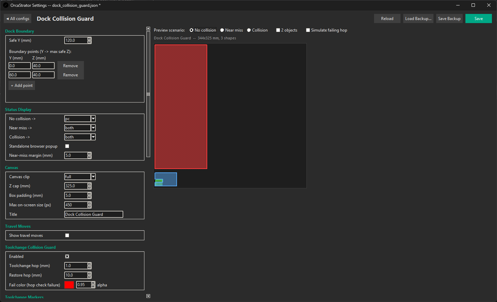</td>
<td>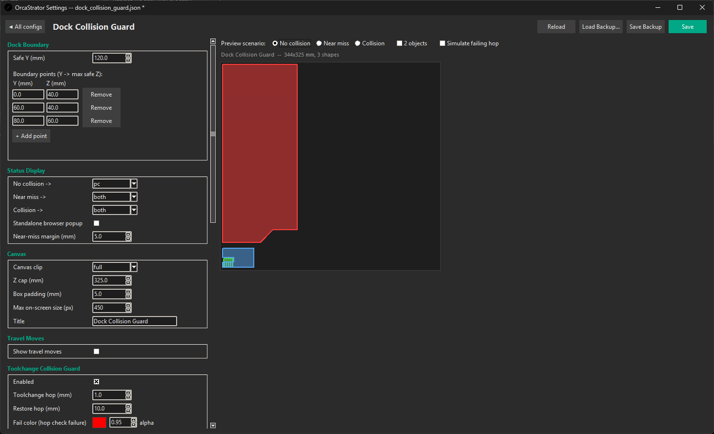</td>
<td>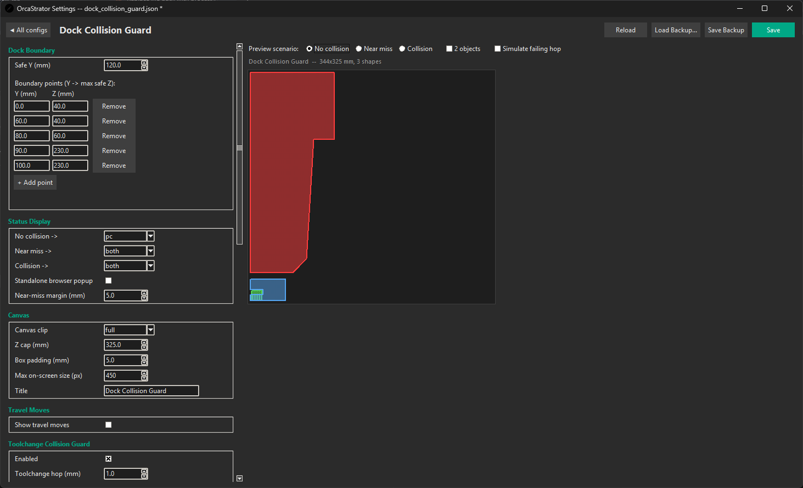</td>
</tr>
</table>

---

### Restore Position Fix

Moves the first print coordinates onto the T command for you to later forward to KTC or do something within your macro.
If you haven't setup Klipper to use these params you shouldn't enable this processor.
For this reason it has been denylisted as a default

```T0 X=123.764 Y=222.842 Z=0.25```

This processor is from Contomo, original source from here https://discord.com/channels/1226846451028725821/1447406494260924477/1447406494260924477

The version in this project has been modified to report the number of T commands that have been patched and to make use of the debug logs

Has no user-facing settings — it always works the same way.

---

### Insert Missing Tool Preheat

Makes sure every tool gets enough advance warning to reach temperature
*before* its very first use in a print, rather than the fixed, often
too-short lead time OrcaSlicer gives it by default. A tool that still
doesn't get enough head start (because it's needed too early in the
print for there to be time) is flagged for your printer's own
start-up sequence to give it a head start instead, if your Klipper
`PRINT_START` macro has been set up to look for that flag.

This flag is ``UNDERHEATED_TOOLS=`` appended to `PRINT_START` an example on how to use this param can be found in the klipper folder.

Shares its one real setting, **target lead time**, with *Disable
Unused Tool Temps* below (see **Tool Preheat** in the settings GUI) —
one shared number so both features agree on how much advance warning
a tool needs.

> This is a best-effort estimate, not an exact countdown — there's no
> way to know your printer's real timing without simulating it, so
> expect it to land in the right ballpark rather than to the second.

---

### Disable Unused Tool Temps

Turns off a tool's heater once it's done being used for the rest of
the print, and — if a tool is just sitting idle for a while rather
than being fully done — temporarily cools it down and schedules a
reheat ahead of its next use, instead of keeping every unused tool hot
the whole time.

Settings available (**Disable Unused Tool Temps** screen):

- **Idle threshold** — how long a tool has to sit unused before it's worth cooling down at all. Leave this on **Auto** to have it calculated automatically from the shared preheat/cooldown timing values (Tool Preheat screen), or set a fixed number of minutes yourself.

---

### Tool Temperature Graph

Purely informational — never touches the g-code, never blocks a print.
Draws a temperature-vs-time graph, one curve per tool, built from
every heating/cooling command actually present in the final file. It's
a simulated curve rather than a real thermistor reading (there's no
telemetry available at export time), ramped using the same warm-up and
cool-down timing already shared with *Insert Missing Tool Preheat* and
*Disable Unused Tool Temps*, so the graph can't quietly drift out of
sync with what those two processors are actually doing to your tools.

Settings available (**Tool Temperature Graph** screen):

- **Tool colors** — leave blank to use each tool's actual filament
  color from the slicer, or set your own per-tool colors.
- **Curve style** — line only, filled area, or both.
- **Layout** — `overlay` draws every tool's curve on one shared band;
  `stacked` gives each tool its own lane so busy multi-tool prints stay
  readable.
- **Axis/canvas sizing** — temperature axis max, canvas width/height,
  and (for stacked layout) the height of each tool's lane.
- **Where it shows up** — PC only, printer only, or both.

<table>
<tr>
	<td>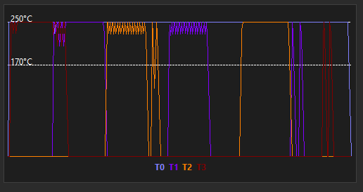</td>
	<td>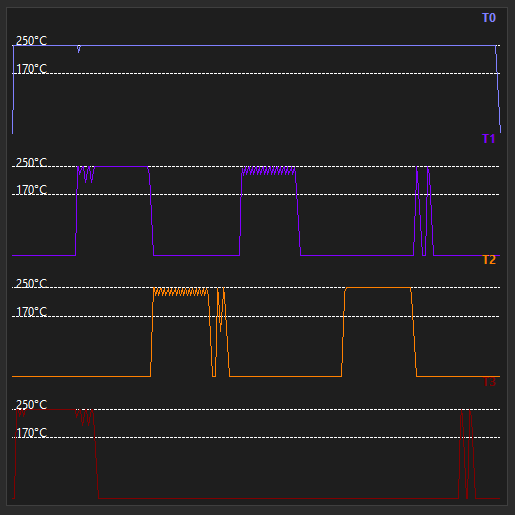</td>
	<td>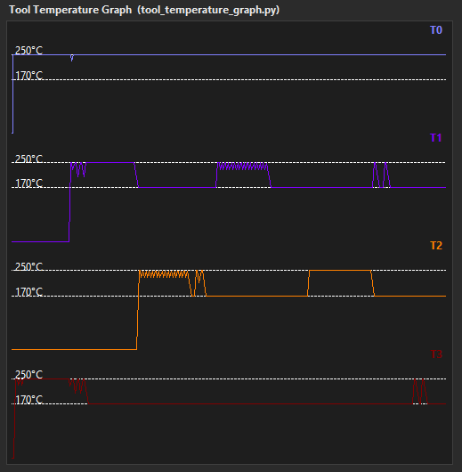</td>
</tr>
	<td align="center">Overlay Layout</td>
	<td align="center">Stacked Layout</td>
	<td align="center">Difference without Disable Unused Tools processor</td>
</table>

---

### Toolchange Heatmap

Purely informational — never touches the g-code, never blocks a print.
Draws a single-lane timeline of every toolchange in the print,
positioned by estimated elapsed print time rather than line number, so
two toolchanges that are close together in the file but far apart in
time aren't shown as neighbors. Busy runs of closely-spaced toolchanges
render as a hot gradient block; isolated toolchanges stay cool. This is
mainly a "how much is this print thrashing between tools, and where" at
a glance.

Settings available (**Toolchange Heatmap** screen):

- **Cool / hot / base colors** — the gradient's two ends, plus a
  separate flat color for stretches of the print with no toolchange
  nearby at all.
- **Clustering sensitivity** — how close together (in estimated
  seconds) toolchanges need to be before they're treated as one hot
  cluster rather than separate, cooler events.
- **Ignore first toolchange** — on by default, since the very first
  toolchange is just the print's initial tool selection, not a real
  mid-print swap.
- **Canvas sizing** and **where it shows up** (PC only, printer only,
  or both), same as the temperature graph above.

Both of these visualizations are read-only reporting steps, so they're
configured (via `explicit_order_last` on the **OrcaStrator** settings
screen) to always run after every other post-processor, once the
g-code is in its final form.

<p align="center">
	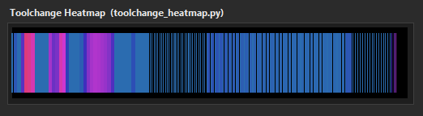
</p>

---

### G-code Template Notice

Lets you write your own custom message templates, with live values
from the actual print substituted in, and have each one shown as a
printer notice, written into the file as a plain comment, or used to
refuse the print outright if something looks wrong. By default this is
purely informational and never blocks a print — that only changes if
you deliberately opt a template into the **Abort print** destination
below. This is the most technical processor in the pack — it's really
a small templating language — so this section goes into more depth
than the others.

No templates configured = this processor does nothing at all, same
"off by default, opt-in" shape as everything else here.

**Where notices are displayed:** each template you write independently
targets one or more of:

- **Printer notice** — shown exactly where every other processor's
  notices are shown: in OrcaStrator's own export window on your PC as
  the file is processed, and (if you've installed the Klipper macro)
  on the printer's screen at the start of the print. It follows the
  same on/off-by-default console visibility as any other notice (see
  **Debug logs** below and the Notices setting on this screen) — the
  underlying data is always kept either way, only whether it clutters
  the printer console at print time changes.
- **G-code comment** — written as a plain `; <name>: <rendered text>`
  line inside its own block near the top of the file. Metadata only;
  it doesn't show up anywhere printer-side, it's just there for anyone
  reading the raw file.
- **Abort print** — refuses to print the file, using the exact same
  mechanism that dock collision guard uses (Klipper's
  `action_raise_error`, via the render macro). Always shows on the
  printer console no matter what this screen's Notices setting says —
  an abort is never something you'd want silently muted. See **Aborting
  a print from a template** below before you reach for this one.

**Placeholders** — anything inside `{...}` — are pulled from two
places, merged into one list:

- **Any setting OrcaSlicer itself resolved into the file**, e.g.
  `{nozzle_diameter}`, `{filament_type}`, `{machine_tool_change_time}`.
  This is *every* key OrcaSlicer writes, not a curated subset — if you
  can see it in your own sliced file, you can use it.
- **A small set of computed values** built from the g-code itself:
  `{total_number_toolchanges}` (count of every toolchange, including
  the initial tool selection) and `{estimated_print_time_seconds}`
  (OrcaSlicer's own printing-time estimate, as whole seconds).

You don't need to memorize either list — the **Templates** screen's
live preview shows every available placeholder for your own printer's
actual settings, generated fresh from a sample file, updated as you
type.

**Valid syntax** inside `{...}`: arithmetic (`+ - * / // %`),
comparisons (`== != < > <= >=`), boolean logic (`and`/`or`/`not`), a
ternary (`condition ? a : b`), string literals (`"..."` or `'...'`),
and calls to a small set of helper functions: `time_format(seconds)`,
`round(x, n=0)`, `number_format(x, decimals=2)`,
`pluralize(n, singular, plural=None)`, `int(x)`, `abs(x)`, `min(...)`,
`max(...)`. Use `{{` and `}}` for a literal brace. A few examples:

| Template text | Renders as (example values) |
|---|---|
| `Nozzle: {nozzle_diameter}mm, filament: {filament_type}` | `Nozzle: 0.4mm, filament: ABS` |
| `Toolchange time: {time_format(machine_tool_change_time * total_number_toolchanges)}` | `Toolchange time: 3h29m04s` |
| `{total_number_toolchanges} {pluralize(total_number_toolchanges, "toolchange")} in this print` | `12 toolchanges in this print` |
| `{"-" * 40}` | `----------------------------------------` (a quick banner/divider) |
| `{nozzle_diameter > 0.4 ? "Big nozzle" : "Standard nozzle"}` | `Standard nozzle` |

**Reusing a value with `let`:** `{let name = expr}` computes `expr`
once and stores it under `name` for reuse in later `{...}` blocks —
handy when a template refers to the same computed value more than
once, so it's only worked out a single time. A `let` block itself
renders as nothing:

| Template text | Renders as (example values) |
|---|---|
| `{let tc = machine_tool_change_time * total_number_toolchanges}Toolchange time: {time_format(tc)} ({tc}s)` | `Toolchange time: 3h29m04s (12564s)` |

A few rules worth knowing:
- A `let` name is only visible to `{...}` blocks *after* it in the
  same template — there's no hoisting, same as reading top to bottom.
- It's scoped to that one template's render only; it can never leak
  into another template, or into a later render of the same one.
- If the name matches a real placeholder, it shadows it for the rest
  of that render — ordinary variable-assignment behavior.
- `let` is a reserved word, so it can't double as a placeholder name.

The default config ships with a fuller worked example (toolchange time
summary, banner included) — open the **Templates** screen to see it
rendered live.

**What happens on an error:** a broken template never blocks the
print — same "informational metadata, not a correctness check" spirit
as Tool Temperature Graph / Toolchange Heatmap above. If part of a
template fails to resolve (unknown placeholder, a typo'd expression,
division by zero, anything), just that `{...}` piece renders inline as
`<ERR:the_expression>` and the rest of the template still renders
normally — plus a `warning` notice is emitted alongside it explaining
what broke, so the problem stays visible instead of silently vanishing
or taking down the whole message. (This is separate from a broken
**condition** — see below — which is about whether a template fires at
all, not about its rendered text.)

**Only firing on a condition:** every template has an optional
**Only if:** field — a `true`/`false` expression, same syntax as a
`{...}` placeholder just without the braces, that gates the *whole*
template. Leave it blank and the template always fires. Fill it in and the template — every
destination it's set to, notice/comment/abort alike — only fires when
the condition evaluates true; on every other print it stays completely
silent.

| Only if: | Fires when... |
|---|---|
| `curr_bed_type != "High Temp Plate"` | the sliced profile's bed type isn't what you expect |
| `nozzle_diameter > 0.4` | a wider nozzle than usual is selected |
| `total_number_toolchanges > 50` | an unusually toolchange-heavy print |

A condition that fails to evaluate (an unknown placeholder, a typo)
is treated as **false** — it just never fires, the same "a mistake in
your own template is never itself the reason a print gets refused"
principle as everywhere else here — and a `warning` notice calls out
the broken condition so the typo doesn't go unnoticed.

**Aborting a print from a template:** pairing an **Only if:** condition
with the **Abort print** destination is how you turn a placeholder
into a refuse-to-print check of your own — no code, no macro changes,
just a template. For example: watching for the wrong bed type and
refusing to print rather than risk it —

| Field | Value |
|---|---|
| Only if: | `curr_bed_type != "High Temp Plate"` |
| Text | `Wrong bed type selected: {curr_bed_type}. Expected High Temp Plate.` |
| Send to: | Abort print |

On a normal print where the condition is false, this template does
nothing at all — no console message, nothing. Only on the one print
where the bed type is wrong does it fire, refuse the print (Klipper's
`action_raise_error`, the exact same mechanism that dock collision guard uses), and show your message explaining why.

A couple of things worth knowing before you reach for this:
- **A template with no condition and the Abort print destination
  refuses every single print, unconditionally.** That's a valid thing
  to want (e.g. "this printer profile should never be used again"),
  but it's very easy to tick by accident — the settings screen calls
  this out with its own warning right on the checkbox.
- An abort notice always shows on the printer console, ignoring this
  screen's own Notices setting — muting the one thing that's actively
  stopping your print would defeat the point.
- Keep the message plain and actionable (what's wrong, and ideally
  what to check) — it's the only thing standing between you and a
  generic, unhelpful "post-processing script failed" dialog from
  OrcaSlicer itself.

<p align="center">
	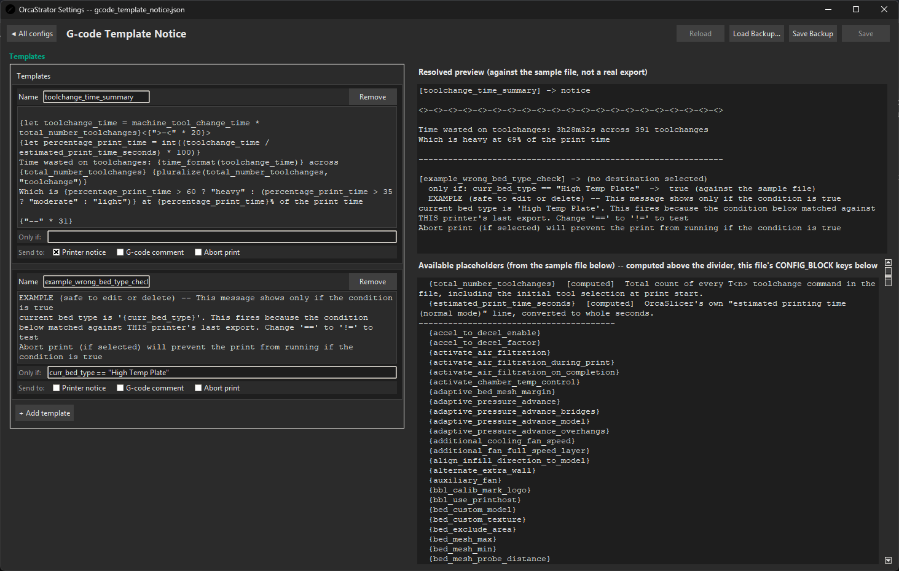
</p>

---

## Debug logs

Most post-processors can optionally write a detailed log of exactly
what they decided and why on the last file they processed — useful if
something didn't happen the way you expected and you want the exact
data rather than guessing. These are on by default and can be reviewed
from the **Debug Logs** entry on the Settings GUI landing page (a
read-only viewer — click an entry to preview it), or opened directly
from the debug directory on disk (`post_processors/logs` by default).

By default each processor's log gets overwritten on every export, so
you're always looking at the latest run. Under the **OrcaStrator**
settings screen's Debug section, you can switch the log mode to
**multiple** instead — a single switch that applies to every
opted-in processor at once, keeping a capped history of recent runs
per processor rather than just the last one. Any processor with more
than one saved log then shows up grouped under its own name in the
Debug Logs viewer; click it to expand and pick which run to look at.
This is also what lets the Tool Temperature Graph and Toolchange
Heatmap settings screens preview against a run other than the most
recent one, rather than only ever the latest export.

You generally won't need these day-to-day — they're there for
troubleshooting.

<p align="center">
	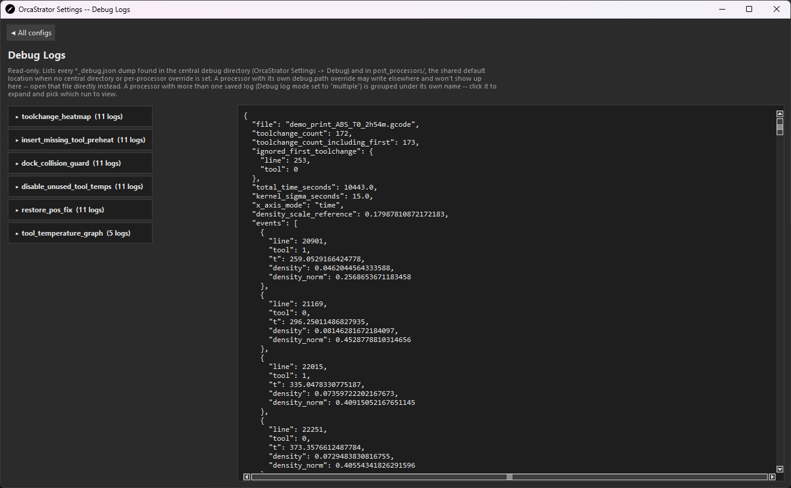
</p>


---

## Adding new processors

All technical details of the project are in the claude.md if you would like to code your own.
By far the easiest and fastest way is to provide claude with a zip of the Orcastrator folder and a small gcode example.
Explain that you want to create a new processor, what you want it to do and why. If you can explain the algorithm or what success looks like this will also help.

This was the initial prompt that built the temperature graphs:

```
I would like to create a new processor that graphs the temperatures of each tool 
It will use the target lead time and target cooldown time in tool_preheat.json to use as the warmup and cooldown ramp.
Each tool will be a different colour. all settings are configurable. Toolchange heatmap is a good example to follow.
no assumptions, discuss before building
```

---

## What's optional, at a glance

| Piece | Required? |
|---|---|
| OrcaStrator + its post-processors | **Required** — this is the core pipeline. |
| Individual post-processors | Optional — each can be turned off independently from OrcaStrator's settings. |
| Settings GUI | Optional to *run*, but it's the intended way to change any setting. Every setting also lives in a plain, commented `.json` file if you'd rather edit by hand. |
| Klipper macro | Fully optional. Without it, OrcaStrator still checks and fixes every file the same way — you just won't see anything on the printer itself, and an unsafe file's *second* line of defense (the printer refusing to start it) won't be there. |
| `UNDERHEATED_TOOLS` printer-side preheat | Optional, and only takes effect if your own `PRINT_START` macro is written to look for it. OrcaStrator will still flag underheated tools in its own log either way — this package doesn't include a `PRINT_START` macro itself, since that's specific to your printer's setup. An example of the toolheating section that will handle the UNDERHEATED_TOOLS param can be found in the klipper folder. This requires certain params to be parsed in from your machine gcode, example at the top of the file. Replace your current toolheating section with this snippet. |
